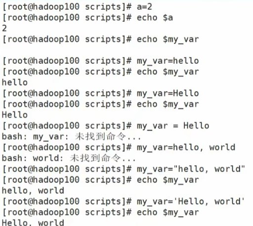
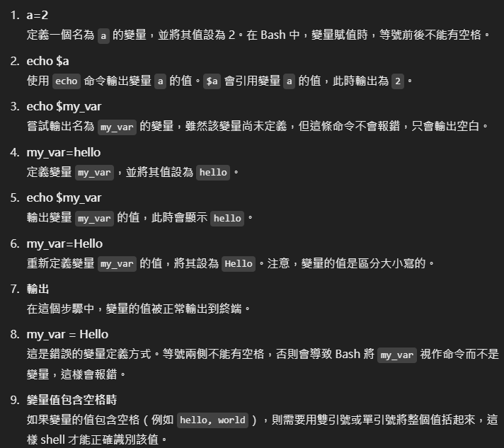
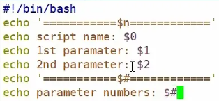
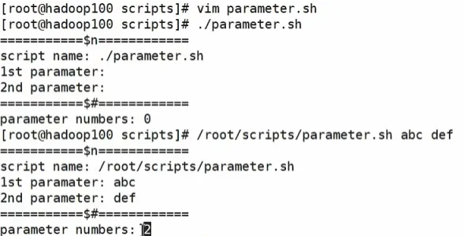
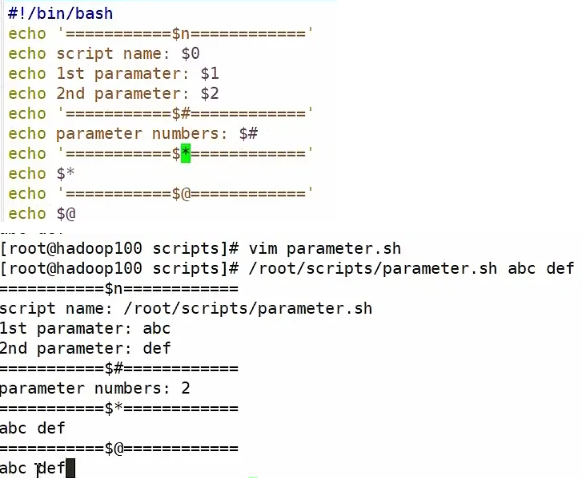
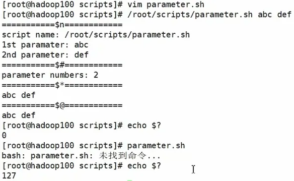

# Shell 腳本入門

```bash
# 腳本開頭
#!/bin/bash(指定解析器)

touch helloworld.sh
vim helloworld.sh

# 内容
# !/bin/bash
echo "hellow world"
```

```bash
# 腳本的常用執行方式
# 1.bash或sh + 腳本的相對路徑或絕對路徑 （不用賦予腳本+x權限）（重新開了一個進程執行bash命令）

sh ./helloworld.sh
bash ./helloworld.sh

# 2.給腳本賦予執行權限後，直接執行（在腳本的第一行添加shebang路徑，這樣可以直接執行腳本，而不需要重新開啟進程）
chmod +x ./helloworld.sh
./helloworld.sh

# 3.在腳本的路徑前加“.”或者source
#!/bin/bash
source helloworld.sh
. helloworld.sh

# 原因：
# 1.腳本在執行時，會開啟一個新的進程，這樣會導致腳本中的變量、環境變量等在腳本執行完後失效。
# 2.通過“.”或者source命令，可以讓腳本在當前shell進程中執行，這樣腳本中的變量、環境變量等在腳本執行完後仍然有效。
# 3.這就是為什麽我們每次要修改完/etc/profile文件以後，需要source一下的原因。
# 開子shell與不開子shell的卻別就在於，環境變量的集成關系，如在子shell中設置的當前變量，父shell是不可見的。
```

## 腳本中的變量

### 變量定義

- 1.變量名和等號之間不能有空格
- 2.變量名區分大小寫
- 3.變量名不能使用特殊字符
- 4.變量名不能使用數字開頭
- 5.變量名不能使用空格
- 6.變量名不能使用特殊字符

```bash
#常用系統變量
$HOME 家目錄
$PATH 環境變量
$PWD 當前工作目錄
$PS1 主提示符
$PS2 次提示符
$UID 用戶ID
$USER 用戶名
$HOSTNAME 主機名

# 顯示當前Shell中所有變量：
env #不僅用於顯示環境變量，還可以在運行命令時臨時設置或修改環境變量。env 的典型用法是在不修改當前 shell 環境的情況下，以新的環境變量運行某個命令。

set # 顯示當前shell中所有變量，包括環境變量、用戶定義的變量、以及 shell 內部的函數

printenv # 專門用於顯示環境變量。它的功能相對簡單，只是輸出當前環境中的變量及其值。

printenv USER # 顯示變量USER的值

echo $HOME # 查看系統變量的值
```


```bash
# 其他常見命令

my_var="Hello"
echo $my_var  # 在當前 shell 中可輸出 "Hello"
bash -c 'echo $my_var'  # 在子進程（新 shell）中無法使用 my_var，輸出空白

# 使用 export my_var 將變量變成環境變量後，它就能夠在子進程中被訪問到。

export my_var="Hello"
bash -c 'echo $my_var'  # 這次在子進程中可以正常輸出 "Hello"
#export my_var 會將變量 my_var 從當前 shell 導出為環境變量，讓它能在該 shell 的所有子進程中可用，如果不使用 export，該變量只在當前 shell 有效，無法在其他子進程中使用。

# 使用 readonly 命令將變量設置為只讀，這樣就無法再修改該變量的值，並且不能unset
readonly my_var="Hello"
echo $my_var  # 輸出 "Hello"
my_var="World"  # 這會導致錯誤，因為 my_var 被設置為只讀

unset my_var # 刪除變量
```
- bash -c 是一個用來在 Bash 中執行指定命令的選項。-c 參數後跟著一個字符串，這個字符串會被當作 Bash 命令來執行。

## 特殊變量
### $n
基本語法
```bash
$n  功能描述：n為數字，$0代表該腳本名稱，$1-$9代表第一到第九個參數。十以上的參數需要用大括號包含，比如 ${10}
```

```bash

touch parameter.sh   創建parameter.sh這個文件
vim parameter.sh     編輯文件中的內容，下面就是文件內容

#!/bin/bash
echo '========$n========='
echo $0
echo $1
echo $2

chmod 777 parameter.sh  修改文件權限
./parameter.sh cls xz   執行文件 將cls xz 參數的值傳入進去
                        下面是輸出之後的內容

========$n=========
./parameter.sh
cls
xz
```

### $#

```bash
$#  功能描述：獲取所有輸入參數個數，常用於循環，判斷參數的個數是否正確以及加強腳本的健壯性
```



### $* 
```bash
$*  功能描述：這個變量代表命令行中所有的參數，$*數組把所有的參數看成一個整體，
```

### $@
```bash
$@  功能描述：這個變量也代表命令行中所有的參數，不過 $@ 把每個參數區別對待，相當於是所有參數組成的數組
```


### $?  
```bash
$?  功能描述：最後一次自行的命令的返回狀態。如果這個變量的值為0，證明上一個命令正確執行；如果這個變量的值為 非0 （具體是哪個數值，由命令自己來決定），則證明上一個命令執行不正確了
```


## 運算符

```bash
$((運算式)) 或 $[運算式]

S=$[(2+3)*4]
echo $S

#加法腳本
#!/bin/bash
sum=$[$1 + $2]
echo sum=$sum          
```


