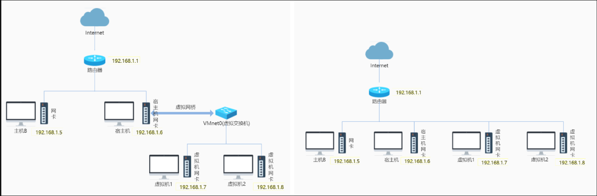
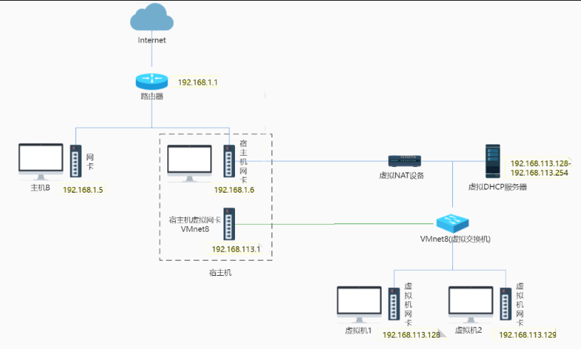
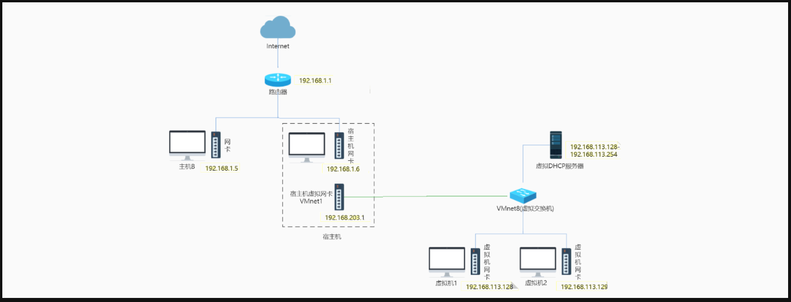

VMware管理了3個特殊的虛擬交換機：VMnet0（用於橋接模式），VMnet8（用於NAT模式），VMnet1（用於僅主機模式）。
# 橋接模式簡介

在橋接模式下，虛擬機像是直接接入到真實的物理網路一樣，與宿主機處於相同的網路環境中，並且有自己的IP地址。這意味著虛擬機和宿主機之間可以互相通訊，虛擬機也可以直接和外部的網路（例如互聯網）通訊，就像它是一台實體機器。

---

### 具體操作與原理：

1. **網絡連接設置**：
   - 當虛擬機處於橋接模式時，宿主機的網卡會通過虛擬網橋（例如 VMware 中的 VMnet0）來管理虛擬機。這樣，所有使用橋接模式的虛擬機都會連接到相同的虛擬網橋上，從而與外部網絡建立連接。

2. **IP地址管理**：
   - 虛擬機的IP地址必須與宿主機處於同一個網段。如果需要聯網，虛擬機的網關和DNS設置必須與宿主機一致，才能順利上網。

3. **信息轉發**：
   - 虛擬網橋會接收宿主機網卡接收到的廣播、組播信息，並轉發給虛擬機。這些信息可能包括來自路由器的DHCP信息，這樣虛擬機也能像實體機一樣自動獲取IP地址和路由更新。

---

### 應用場景：
這種模式適合需要虛擬機能夠像一台物理機器一樣參與網絡的情況，特別是在測試環境中，虛擬機需要像一台真實的伺服器一樣運作時。
---

## 橋接模式（Bridged Networking）網路連接圖解

這張圖片展示了**橋接模式**（Bridged Networking）下的兩種不同的網路連接場景：

---

### 左側圖解：

1. **網絡拓撲：**
   - 路由器（IP：192.168.1.1）作為整個網絡的核心，將外部網絡（如互聯網）與內部網絡連接。
   - 宿主機（IP：192.168.1.6）和另一台物理機器（主機B，IP：192.168.1.5）都直接通過各自的網卡連接到路由器。
   - 宿主機還連接了一個虛擬網橋（VMnet0），該網橋通過宿主機的網卡將虛擬機1和虛擬機2連接到物理網絡。

2. **IP地址分配：**
   - 在此架構下，虛擬機1和虛擬機2分別獲得了192.168.1.7和192.168.1.8的IP地址，這些IP與物理機器的IP處於同一網段中。
   - 因此，虛擬機、宿主機以及主機B都可以互相通信，並通過路由器訪問互聯網。

3. **橋接模式特點：**
   - 這個網絡配置讓虛擬機能夠與物理網絡中的其他設備相互通信，就像它們是網絡中的普通設備一樣。
   - 虛擬機可以像物理機一樣通過路由器獲得IP地址。

---

### 右側圖解：

1. **網絡拓撲：**
   - 路由器（IP：192.168.1.1）仍然是網絡的核心，所有的設備（宿主機和虛擬機）直接連接到路由器。
   - 不同之處在於，宿主機和虛擬機1、虛擬機2都是直接透過網卡連接到路由器，而不經過虛擬網橋。

2. **IP地址分配：**
   - 在這種配置下，宿主機（IP：192.168.1.6）、虛擬機1（IP：192.168.1.7）和虛擬機2（IP：192.168.1.8）都由路由器分配IP地址，並與路由器直接相連。

3. **橋接模式的應用：**
   - 這種配置模式類似於將虛擬機直接連接到物理網絡，虛擬機像獨立的物理設備一樣運作，不再依賴宿主機的網絡設置。
   - 虛擬機、宿主機及其他網絡設備（如主機B）能夠互相通信，並通過路由器訪問外部網絡。

---

### 總結：

這兩張圖展示了橋接模式下虛擬機的不同網絡連接方式：
- **左側**展示了虛擬機通過虛擬網橋與物理網絡連接的情況，宿主機管理虛擬機的網絡。
- **右側**展示了虛擬機直接與路由器進行連接，並獲得獨立的IP地址的情況，讓它們像物理機一樣運作。

這兩種連接方式的區別在於，是否需要使用虛擬網橋來管理虛擬機的網絡，這取決於具體的應用場景。
"""

# NAT模式（Network Address Translation）簡介

---

### NAT模式概述：
1. **什麼是NAT模式？**
   - NAT模式就是讓虛擬機和宿主機之間建立一個專用的內部網絡，虛擬機的網絡流量通過宿主機的NAT設備來進行IP地址轉換。這樣虛擬機可以使用宿主機的IP地址來訪問外部網絡，但外部網絡無法直接訪問虛擬機。
   - 這種方式適合當虛擬機需要訪問外部網絡（如互聯網）而不需要被外部設備直接訪問的情況。換句話說，虛擬機通過宿主機「借到」網絡，這樣就可以上網了。

2. **為什麼選擇NAT模式？**
   - 如果你的網絡資源有限，但又需要虛擬機能夠上網，NAT模式是最好的選擇。它使用宿主機的網絡資源，並通過NAT伺服器自動為虛擬機分配內部IP地址，虛擬機就能像宿主機一樣訪問網絡。

---

### NAT模式的工作原理：
1. **網絡連接：**
   - 虛擬機通過VMnet8虛擬交換機連接到宿主機。VMnet8會模擬NAT設備，並提供一個虛擬的DHCP伺服器，為虛擬機分配IP地址。
   - 虛擬機的所有網絡請求會先通過VMnet8到宿主機的NAT設備，再由NAT轉發到外部網絡。外部網絡的返回數據也會經由宿主機再轉發回虛擬機。

2. **內外網隔離：**
   - 虛擬機的內部網絡（由VMnet8承載）與外部的網絡是隔離的。虛擬機無法直接訪問物理網絡中的其他設備，而其他設備也無法直接訪問虛擬機。但虛擬機可以通過宿主機訪問互聯網。

3. **通信限制：**
   - 雖然虛擬機可以通過NAT設備訪問互聯網，但它無法直接訪問宿主機的網絡範圍內的其他設備（例如另一台電腦或打印機）。同時，這些設備也無法訪問虛擬機。這是NAT模式的一個重要特點。

---

### 總結：
- **NAT模式的優點**：虛擬機可以像宿主機一樣訪問外部網絡，而無需直接暴露在外部，這增加了虛擬機的安全性。
- **NAT模式的限制**：虛擬機無法直接訪問宿主機所在的內部網絡，這讓虛擬機和內部網絡的其他設備隔離開來，適合需要保護虛擬機不被外部設備直接訪問的場景。
"""

# NAT模式下的網絡拓撲結構圖解（包含虛擬NAT設備）

---

### 圖中結構解釋：

1. **路由器 (192.168.1.1)**：
   - 路由器連接到外部互聯網，並為宿主機及主機B提供網絡服務。

2. **主機B (192.168.1.5)**：
   - 主機B通過物理網卡直接連接到路由器，獲得IP地址`192.168.1.5`，可以直接訪問外部網絡。

3. **宿主機 (192.168.1.6 和 192.168.113.1)**：
   - 宿主機有兩個網卡：一個物理網卡（IP地址`192.168.1.6`），它通過路由器連接到外部互聯網。
   - 另一個虛擬網卡 (`VMnet8`，IP地址`192.168.113.1`) 用於內部與虛擬機進行通信。

4. **虛擬NAT設備**：
   - 虛擬NAT設備負責將虛擬機的內部IP地址轉換為宿主機的外部IP地址，並轉發流量到外部網絡。這個設備允許虛擬機通過宿主機的網卡訪問外部網絡。

5. **虛擬DHCP伺服器**：
   - 虛擬DHCP伺服器負責為虛擬機分配IP地址，範圍在`192.168.113.128`到`192.168.113.254`之間。所有虛擬機的IP地址都來自這個範圍。

6. **虛擬機1和虛擬機2**：
   - 這些虛擬機通過VMnet8虛擬交換機與宿主機進行通信，獲得的IP地址範圍是`192.168.113.128`到`192.168.113.254`。虛擬機無法直接與物理網絡通信，所有流量需經由虛擬NAT設備進行地址轉換後，才能訪問外部網絡。

7. **VMnet8虛擬交換機**：
   - VMnet8是一個虛擬交換機，將虛擬機與宿主機的內部網絡進行連接。虛擬機與宿主機通過這個交換機進行通信。

---

### 工作流程：

- **虛擬機的網絡流量**：
   - 虛擬機1和虛擬機2使用內部IP地址（`192.168.113.x`）進行通信。當虛擬機需要訪問外部網絡時，它們的流量會先通過VMnet8虛擬交換機進入宿主機，再由虛擬NAT設備將內部IP地址轉換為宿主機的外部IP地址（`192.168.1.6`），以便與外部網絡通信。

- **DHCP伺服器**：
   - 虛擬DHCP伺服器負責為虛擬機分配內部IP地址。這些地址來自`192.168.113.128`至`192.168.113.254`範圍。虛擬機的所有流量在到達外部網絡前，會經過NAT設備進行IP轉換。

---

### 總結：

- **虛擬NAT設備** 是這個網絡架構中的核心，它負責將虛擬機的內部IP地址轉換成宿主機的外部IP地址，讓虛擬機可以通過宿主機訪問互聯網。
- **NAT模式** 保護了虛擬機不被外部網絡直接訪問，虛擬機的網絡流量經過NAT設備後，才能與外部網絡進行通信，這提高了安全性並簡化了網絡管理。
"""

📍使用NAT模式，就是讓虛擬機借助NAT（網絡地址轉換功能），通過宿主機所在的網絡來訪問互聯網。

📍在虛擬機連接Vmnet8虛擬交換機時，虛擬機會將虛擬NAT設備及虛擬DHCP服務器連接到Vmnet8虛擬交換機上。依靠虛擬的NAT設備及虛擬的DHCP設備，如果你的宿主機已經聯網了，那麽你的虛擬機也就可以聯網。

📍同時宿主機上的虛擬網卡VMwareNetwork Adapter VMnet8也會連接到Vmnet8虛擬交換機上，用於宿主機和虛擬機的通信。如果禁用掉宿主機上的虛擬網卡VMwareNetwork Adapter VMnet8，虛擬機仍然是可以上網的，只是宿主無法再訪問VMnet8網段下的虛擬機了，但是虛擬機仍然可以訪問宿主機。

📍虛擬網卡VMwareNetwork Adapter VMnet8只是作為主機與虛擬機通信的接口，虛擬機並不是依靠虛擬網卡VMware Network Adapter VMnet8來聯網的。

📍由於NAT服務協議對外部網絡隱蔽內部網絡，因此虛擬機可以通過NAT服務器訪問宿主機所在局域網內的其他真實主機，但這些真實主機且不能反過來訪問虛擬機。
                        
原文鏈接：https://blog.csdn.net/da_ge_de_nv_ren/article/details/128391575

# 僅主機模式下的網絡拓撲結構圖解

---

### 圖中結構解釋：

1. **路由器 (192.168.1.1)**：
   - 路由器連接到外部互聯網，並提供網絡服務給主機B和宿主機。

2. **主機B (192.168.1.5)**：
   - 主機B通過物理網卡直接連接到路由器，獲得IP地址`192.168.1.5`，可以直接訪問外部網絡和宿主機。

3. **宿主機 (192.168.1.6 和 192.168.203.1)**：
   - 宿主機有兩個網卡：一個物理網卡（IP地址`192.168.1.6`），通過路由器與外部網絡（如互聯網）進行通信。
   - 另一個虛擬網卡（`VMnet1`，IP地址`192.168.203.1`）用於僅主機模式下虛擬機與宿主機之間的通信。這個網卡是宿主機專門用來與虛擬機進行內部網絡連接的，不與外部網絡進行通信。

4. **虛擬機1和虛擬機2**：
   - 這些虛擬機通過VMnet1與宿主機進行通信。它們的IP地址範圍在`192.168.113.x`，由虛擬DHCP伺服器分配。這些虛擬機無法直接與外部網絡通信，所有通信僅限於宿主機和內部網絡中的其他虛擬機。

5. **VMnet1虛擬交換機**：
   - VMnet1是宿主機與虛擬機之間的內部網絡交換機。它為虛擬機提供與宿主機的連接，使虛擬機能夠與宿主機進行內部通信。

---

### 工作流程：

- **內部通信**：
   - 虛擬機1和虛擬機2使用內部網絡地址（如`192.168.113.x`），它們只能與宿主機及其他同樣設置為僅主機模式的虛擬機進行通信。這些通信通過VMnet1虛擬交換機完成。
   - 宿主機可以與虛擬機通信，但這些虛擬機無法訪問外部網絡，因為它們與物理網絡（如路由器和互聯網）是隔離的。

- **虛擬DHCP伺服器**：
   - 虛擬DHCP伺服器為虛擬機分配IP地址，這些IP地址來自內部網絡，範圍為`192.168.113.128`至`192.168.113.254`。

---

### 總結：

- **僅主機模式** 使虛擬機只能與宿主機和其他虛擬機通信，這些虛擬機無法訪問外部網絡，也無法被外部網絡訪問。這種配置適合需要內部隔離、測試、開發或數據隔離的場景。
"""

