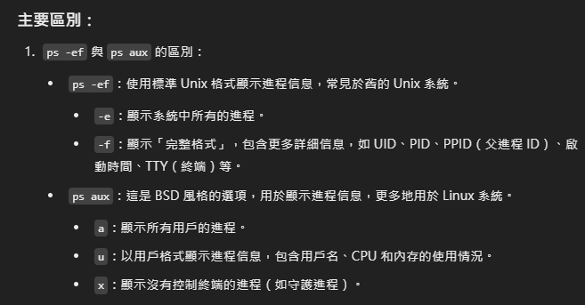
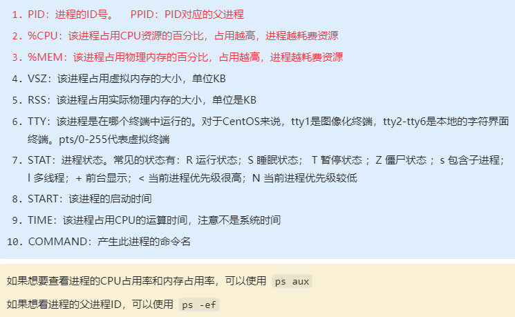
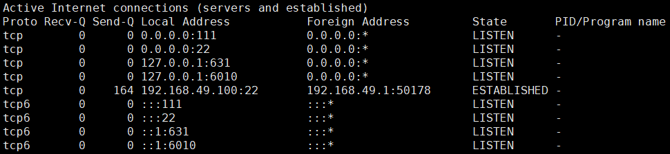
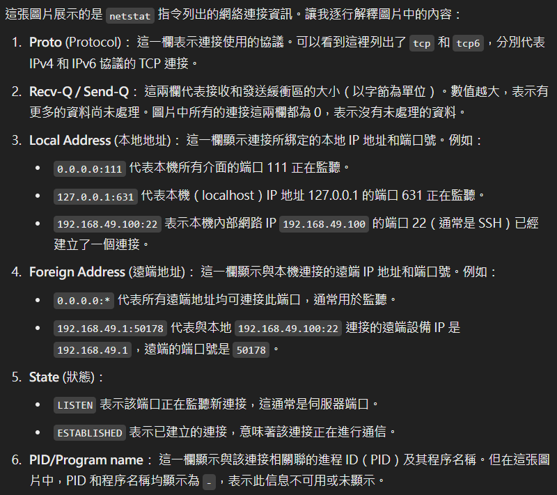
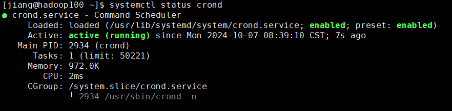
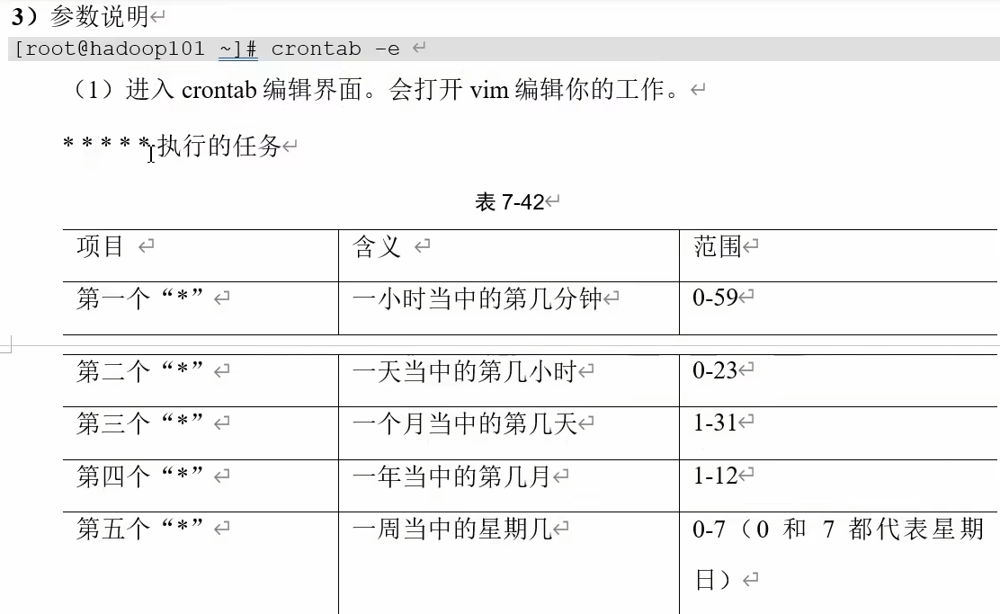
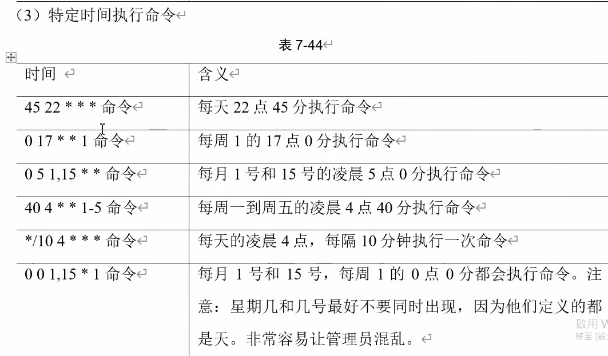
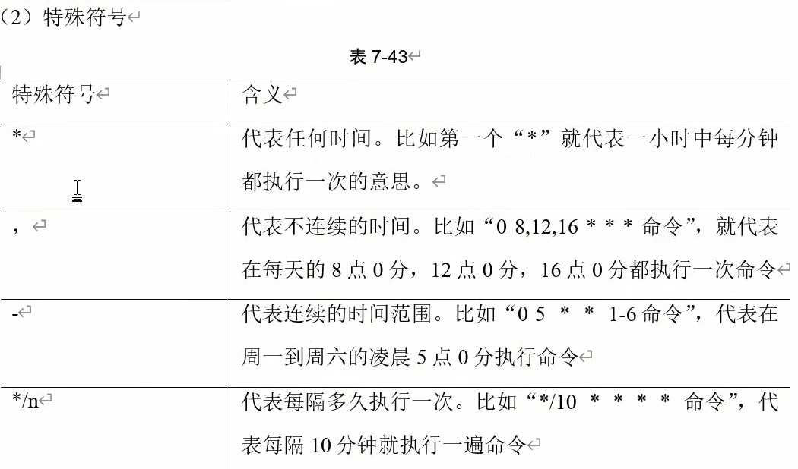

# process管理類
## 進程是正在執行得給程序或命令，每一個進程都是一個運行的實體，都有自己的地址空間，並占用一定的系統資源

## ps 查看系統中所有進程
### 常用參數
選項|描述
- a|列出帶有終端的所有用戶的進程
- x|列出當前用戶的所有進程，包括沒有終端的進程
- u|面向用戶友好的顯示風格
- -e|列出所有進程
- -u|列出某個用戶關聯的所有進程
- -f|顯示完整格式的進程列表

### 實例
```bash
ps -ef | grep 'nginx'
```
### 這條命令首先列出系統中的所有進程，然後使用 grep 過濾出那些與 nginx 相關的進程。nginx 是一個常見的網絡服務器軟件，所以這條命令經常被用來檢查 nginx 是否正在運行，或查看 nginx 相關的進程信息。
```bash
ps aux | grep xxx   查看系統中所有進程
```


```bash
ps aux | less   查看系統中所有進程(分頁顯示)
```
```bash
'如果想查看process的cpu占用率和內存占用率可以使用aux'  
'如果想查看父process的c占用率和內存占用率可以使用ef'  
```


```bash
USER       PID  %CPU %MEM    VSZ   RSS TTY      STAT START   TIME COMMAND
root         1  0.0  0.2 175344  19092 ?        Ss   04:00   0:01 /usr/lib/systemd/systemd --deserialize 31

```
```bash
USER: root
- 這個進程是由 root 用戶啟動的，root 是系統的超級用戶（最高權限的用戶）。

PID: 1 
- 表示這是系統的初始進程（systemd 或舊的 init 系統）
PIID 0
- PID對應的父進程。

%CPU: 0.0
- 這個進程當前佔用了 0.0% 的 CPU 資源，也就是幾乎沒有在佔用 CPU。

%MEM: 0.2
- 這個進程佔用了 0.2% 的系統物理內存。

VSZ: 175344
- 虛擬內存大小（VSZ）為 175344 KB，也就是 175 MB。這表示該進程可以訪問的虛擬內存的大小。    

RSS: 19092
- 常駐集大小（RSS）為 19092 KB，這表示該進程實際佔用的物理內存大小為 19 MB。

TTY: ?
- 這個進程沒有與任何終端（TTY）關聯，因為它是一個守護進程（daemon），在後台運行，不需要終端輸入/輸出。

STAT: Ss
- S：表示該進程處於 睡眠狀態（sleeping），等待某些事件的發生。
- s：表示這是一個 會話領導進程（session leader），通常是啟動其他進程的主進程（如 systemd 是會話的主進程）。

START: 04:00
- 這個進程是在早上 4:00 啟動的，這可能是系統啟動的時間。

TIME: 0:01
- 這個進程總共消耗了 1 秒的 CPU 時間，這是該進程自啟動以來在 CPU 上運行的累計時間。

COMMAND: /usr/lib/systemd/systemd --deserialize 31
- 這是該進程的命令行，表示該進程運行的是 systemd 程序，並帶有 --deserialize 31 這個參數。systemd 是現代 Linux 系統中的初始化系統，負責管理系統的啟動過程以及其他系統服務的啟動和監控。
```


## kill 終止進程
### 語法
```bash
kill [選項] 進程ID
```
選項 -9   表示強迫進程立即停止

## pstree 查看進程樹
### 語法
```bash
pstree [選項]
-p   顯示進程的PID
-u   顯示進程的所屬用戶
## 具體進程運行狀態
  a. PID：當前進程ID
  b. USER：哪個用戶的進程
  c. PR：當前系統任務調度的優先級
  d. NI：用戶指定的nice值（nice值越小）
  e. VIRT：虛擬內存占用的大小
  f. RES：實際內存，物理內存使用大小
  g. SHR：共享內存
  h. S：status狀態
  i. %CPU：CPU計算時間的占比
  j. %MEM：內存的占比
  k. TIME+：精確到0.01秒的已經占用到cpu的總時間
```
## top 動態顯示系統進程資源
### 語法
```bash
top [選項]
-d 秒數   指定top命令每隔幾秒更新一次
-i   使top不顯示空閒進程
-s   使top在安全模式下運行，不接受終端中斷  
-p   通過指定監控進程ID來僅僅監控某個進程的狀態

操作
P  以CPU使用率排序，默認就是此項
M  以內存的使用率排序
N  以PID排序
q  退出top
```
## netstat 查看網絡連接狀態
### 語法
```bash
netstat [選項]
-a  顯示所有正在監聽和未監聽的socket
-t  顯示tcp連接情況
-u  顯示udp連接情況
-l  顯示正在監聽的socket
-n  拒絕顯示別名(主機名)，能顯示ip地址
-p  顯示哪個進程在調用
###常見語法
netstat -anp | grep 進程號(查看該進程網路訊息)
netstat -nlp | grep port號(查看該port號占用情況)
```
「Socket」是一種網路通信的端點，它可以讓兩個設備之間進行資料交換。在網路通訊中，socket 是應用程式層與傳輸層之間的橋樑，負責建立、管理、結束網路連接。

當你使用互聯網時，比如打開網頁，瀏覽器會透過一個 socket 與伺服器進行通信。Socket 本身會有一個 IP 位址和一個 Port（端口號），用來辨識網絡上的設備以及與特定應用程式之間的溝通通道。

常見的 socket 分為兩類：

TCP Socket（傳輸控制協定）：用於建立可靠的、面向連接的數據傳輸。它會確保資料的完整性。
UDP Socket（用戶數據報協定）：這種 socket 不需要建立連接，適合快速傳輸資料，雖然速度快，但無法保證數據的完整性。
簡單來說，socket 就像是一個「插座」，當應用程式「插進去」時，就能透過這個通道來收發資料。

「Socket」是網絡通訊中的一個端點，負責在設備之間傳遞資料。它允許應用程式通過 IP 地址和端口號進行連接和通信。常見的有 TCP 和 UDP 兩種，前者提供可靠的連接，後者則更快但不保證資料完整性。




## crontab 定時任務
###必須先重新啟動crond服務(可以先查看狀態，如果沒有啟動的話，需要先啟動)
```bash
systemctl status crond
systemctl restart crond
```

### 語法
```bash
crontab [選項]
-e  編輯crontab定時任務
-l  查詢crontab定時任務
-r  刪除crontab定時任務
```




## RPM RedHat Package Manager 軟件包管理
中文譯為紅帽軟件包管理器，其功能是用於在Linux系統下對軟件包進行安裝、卸載、查詢、驗證、升級等工作。類似於windows系統下的setup.exe

### RPM包的名稱格式
```bash
Apache-1.3.23-11.i386.rpm
Apache  軟件名稱
1.3.23  軟件版本
11       軟件發行號
i386    軟件適用的硬件平台
rpm     軟件包類型
```
### 語法
```bash
rpm [選項]
-q    查詢軟件包是否安裝（query）
-e    卸載軟件包（erase）
--nodeps   卸載軟件包時不檢查依賴關係（小心使用，可能會破壞系統依賴關係）
-i    安裝軟件包（install）
-v    顯示安裝或卸載過程中的詳細信息（verbose）
-h    安裝或卸載過程中顯示 hash 標記來表示進度（hash marks）
-ql   查詢指定軟件包的文件安裝路徑（query list of files）
-ivh  安裝軟件包並顯示詳細信息和安裝進度（i：安裝, v：詳細信息, h：hash 標記）
-evh  卸載軟件包並顯示詳細信息和卸載進度（e：卸載, v：詳細信息, h：hash 標記）
-Uvh  升級軟件包並顯示詳細信息和升級進度（U：升級, v：詳細信息, h：hash 標記）
-qa   查詢所有已安裝的軟件包（query all）
 
### 常用grep 
rpm -qa | grep 軟件名稱   查詢是否安裝某軟件
# 正常安裝軟件包
rpm -ivh cockpit-185-2.el8.x86_64.rpm 

# 顯示系統已安裝過的全部RPM軟件包
rpm -qa

# 查詢某個軟件的安裝路徑
rpm -ql cockpit

# 卸載某個通過RPM軟件包安裝的服務
rpm -evh cockpit

# 升級某個軟件包
rpm -Uvh cockpit-185-2.el8.x86_64.rpm 
```

## yum 軟件包管理(更方便)
yum命令來自於英文詞組”YellowdogUpdater,Modified“的縮寫，其功能是用於在Linux系統中基於RPM技術進行軟件包的管理工作。yum技術通用於RHEL、CentOS、Fedora、OpenSUSE等主流系統，可以讓系統管理人員交互式的自動化更新和管理軟件包，實現從指定服務器自動下載、更新、刪除軟件包的工作。

🔖yum軟件倉庫及命令能夠自動處理軟件依賴關系，一次性安裝所需全部軟件，無需繁瑣的操作。
### 語法
```bash
yum [選項][參數]
## [選項]
-y  自動回答yes
-q  靜默模式
-e  顯示錯誤信息
-d  顯示調試信息
-v  顯示詳細信息
## [參數]
install         安裝軟件包
update          更新軟件包
check-update    檢查軟件包
remove          卸載軟件包
info            顯示軟件包信息
list            顯示軟件包列表
search          搜索軟件包
clean           清除緩存
deplist         顯示軟件包的依賴關係
```


