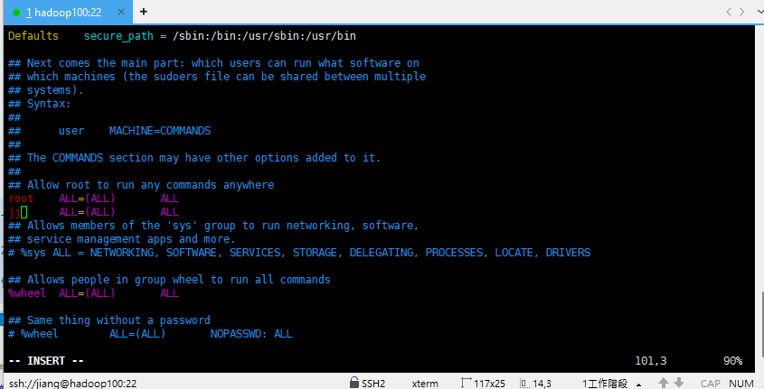
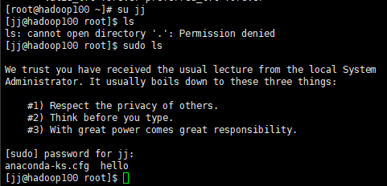

# 用戶權限類

## useradd 添加用戶

- useradd 用戶名 _:_ 添加用戶
- useradd -m 用戶名 _:_ 添加用戶並創建家目錄
- useradd -s /bin/bash 用戶名 _:_ 添加用戶並設置默認 shell 為 bash
- useradd -d /home/目錄 用戶名 _:_ 把用戶創建在指定目錄
- useradd -g 用戶組 用戶名 _:_ 添加用戶並設置用戶組

## userdel 刪除用戶

- userdel 用戶名 _:_ 刪除用戶，但保留目錄
- userdel -r 用戶名 _:_ 刪除用戶及其目錄(不建議，請小心使用)

## 創建新用戶的密碼

- passwd 用戶名 _:_ 創建新用戶的密碼

## 查看用戶信息

- id 用戶名 _:_ 查看用戶信息

## 查看創建了那些用戶

-cat /etc/passwd _:_ 查看創建了那些用戶

## su 切換用戶

- su 用戶名 _:_ 切換用戶
- su - 用戶名 _:_ 切換用戶並切換目錄

## who 查看當前登錄用戶

- who _:_ 查看當前登錄用戶

## sudo 以 root 權限執行命令

- 首先需要在配置文件中配置權限，在 `/etc/sudoers` 文件中新增 jj 那一行



要記得用 `wq!` 保存

- sudo 命令 _:_ 以 root 權限執行命令
  

## 用戶組管理

- groupadd 組名 _:_ 添加組
- groupdel 組名 _:_ 刪除組
- cat /etc/group _:_ 查看所有組
- groupmod -n 新組名 舊組名 _:_ 修改組名
- 用戶 jinag 在和 root 一起創建的時候，會被默認添加到 wheel 組中，而 wheel 組成員在配合 sudo 命令時可以擁有管理員權限操作

## 文件屬性與權限

在 Linux 中，文件屬性由幾個關鍵部分組成。使用 `ls -l` 命令可以看到文件的詳細屬性資訊。以下是解釋文件屬性的各個部分：

```bash
drwxr-xr-x  2  user  group  4096  Sep  26  12:34  myfile
```

### 文件類型與權限 (drwxr-xr-x)：

- **第一個字元表示文件類型**：

  - `-` 表示普通文件。
  - `d` 表示目錄。
  - `l` 表示符號連結。
  - `c` 表示字元設備。
  - `b` 表示塊設備。

- **接下來的九個字元表示權限**：
  - 由三組三位字元組成，分別代表擁有者、所屬組和其他人的權限。
  - `r` 表示可讀 (read)。
  - `w` 表示可寫 (write)。(注意，可以修改，但不代表可以刪除，刪除一個文件需要有對該文件所在的目錄有權限，才能刪除)
  - `x` 表示可執行 (execute)。
  - `-` 表示沒有權限。

## rwx 作用到文件與目錄的不同解釋

### 1. `rwx` 作用到文件：

- **`r` 代表可讀 (read)**：
  - 可以讀取文件內容，查看文件的內容。
- **`w` 代表可寫 (write)**：

  - 可以修改文件內容，但不代表可以刪除該文件。刪除一個文件的前提條件是對該文件所在的目錄具有寫權限，才能刪除該文件。

- **`x` 代表可執行 (execute)**：
  - 可以執行該文件，通常是指腳本或二進制文件。

### 2. `rwx` 作用到目錄：

- **`r` 代表可讀 (read)**：

  - 可以讀取目錄內容，使用 `ls` 命令查看目錄下的文件和目錄。

- **`w` 代表可寫 (write)**：

  - 可以修改目錄的內容，例如在目錄內創建、刪除或重命名文件或子目錄。

- **`x` 代表可執行 (execute)**：

  - 可以進入該目錄，通常意味著可以進行目錄的導航操作,如 `cd` 進入目錄。

- 例如：`drwxr-xr-x` 表示：
  - 這是一個目錄 (`d`)。
  - 擁有者 (user) 有讀、寫、執行權限 (`rwx`)。
  - 所屬組 (group) 有讀和執行權限 (`r-x`)。
  - 其他人 (others) 有讀和執行權限 (`r-x`)。

### 連結數 (2)：

- 如果查看的是文件，表示該文件有多少個硬連結。
- 如果查看的是目錄(文件夾)，目錄的連結數表示它的子目錄數量加上 2（包括一個指向當前自身目錄 `.`，一個指向上層目錄 `..`，也就是父目錄）。

### 擁有者 (user)：

- 文件的擁有者，即擁有該文件的用戶。

### 所屬組 (group)：

- 文件所屬的用戶組。組內的所有用戶可能會共享某些權限。

### 文件大小 (4096)：

- 文件的大小，單位為位元組 (bytes)。對於目錄來說，這表示目錄中文件列表所佔用的空間。

### 修改時間 (Sep 26 12:34)：

- 文件最後一次被修改的時間。

### 文件名 (myfile)：

- 文件或目錄的名稱。

---

### 修改文件權限

- `chmod` 命令：用於修改文件的權限。
- `a` 表示所有人
- `u` 表示文件的擁有者
- `g` 表示文件的所屬組
- `o` 表示其他人
- `+` 表示添加權限
- `-` 表示移除權限
- `=` 表示設置權限
- `chmod u+x myfile`：給文件的擁有者添加執行權限。
- `chmod g+r myfile`：給文件的所屬組添加讀權限。
- `chmod o-w myfile`：給其他人移除寫權限。
- `chmod a=rw myfile`：給所有用戶添加讀寫權限。
- `r=4` `w=2` `x=1`
- `chmod 755 myfile`：給文件的擁有者添加讀、寫、執行權限，給所屬組和其他人添加讀和執行權限。
- `chmod 644 myfile`：給文件的擁有者添加讀和寫權限，給所屬組和其他人添加讀權限。
- `chmod -R 755 mydir`：給目錄及其所有子目錄和文件添加讀、寫、執行權限。 -R 表示遞歸修改。

## chown 修改文件的擁有者

- `chown newuser:newgroup myfile`：將文件的擁有者修改為 newuser，所屬組修改為 newgroup。
- `chown newuser myfile`：將文件的擁有者修改為 newuser。
- `chown :newgroup myfile`：將文件的所屬組修改為 newgroup。
- `chown -R newuser:newgroup mydir`：遞歸修改目錄及其所有子目錄和文件的擁有者和所屬組。
