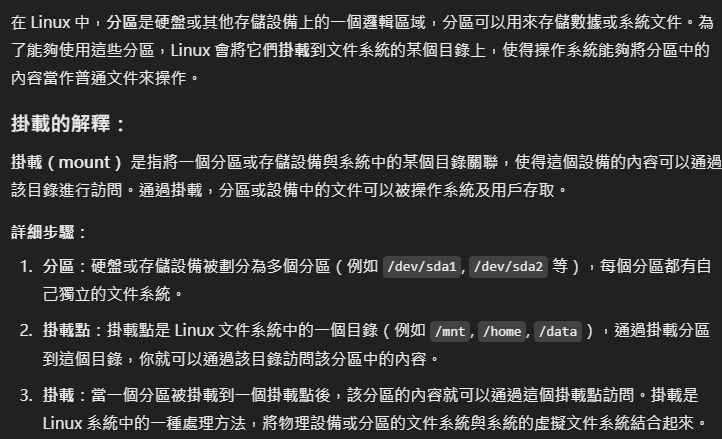

# 磁盤管理類

## tree 將目錄文件以樹形式展示

- tree ./ 將本目錄以樹的形式展示出來

## du 查看文件和目錄占用的磁盤空間

- du 目錄/文件 顯示目錄下每個子目錄對的磁盤使用情況
- 參數
  - -h: 以人類可讀的方式顯示
  - -s: 顯示總計
  - -a: 顯示所有文件和目錄(du 只顯示目錄的磁盤使用情況，但使用 -a 選項後，它會顯示目錄中每個文件的大小。)
  - --max-depth=1: 只顯示一層目錄的磁盤使用情況
- du -ah _:_ 顯示目錄和文件的單獨大小，格式為易讀的單位（如 KB、MB、GB 等）。
- du -sh _:_ 僅顯示目錄的總大小，格式為易讀的單位。
- du --max-depth=1 -ah _:_ 將列出指定目錄中每個文件和子目錄的大小，且不深入到更深層的子目錄。

## df disk free 查看磁盤使用情況

- df -h _:_ 查看磁盤使用情況
- df -h /dev/sda1 _:_ 查看 /dev/sda1 磁盤使用情況
- df -h /dev/sda1 /dev/sda2 _:_ 查看 /dev/sda1 和 /dev/sda2 磁盤使用情況
- free -h _:_ 顯示內存的使用情況，包括實際內存和虛擬交換的內存

## lsblk 查看設備掛載資訊

### lsblk -f 查看設備掛載資訊(更詳細)

- xfs 是文件系統類型格式
- UUID 是系統為當前每一個分區分配的唯一標識符 40 位

## mount / umount 掛載 / 卸載

### 補充 

## mount /dev/cdrom /mnt/cdrom _:_ 將 /dev/cdrom 掛載到 /mnt/cdrom

## umount /mnt/cdrom _:_ 將 /mnt/cdrom 卸載

- mount /dev/sda1 /mnt 將 /dev/sda1 掛載到 /mnt
- umount /dev/sda1 /mnt 將 /dev/sda1 從 /mnt 卸載

## fdisk 管理磁盤 (必須在 root 下執行)

### fdisk -l _:_ 查看所有硬盤資訊

### fdisk /dev/sdb _:_ 進入對 /dev/sdb 磁盤的管理介面

###可以看到這時候sdb硬盤是沒有UUID等等的，我們需要進行初始化(格式化)

- mkfs: 這個命令是 "make filesystem" 的縮寫，用來在指定的設備或分區上創建文件系統。
- -t xfs: 指定文件系統的類型為 XFS。
- /dev/sdb1: 這是你要格式化的分區，表示硬盤 /dev/sdb 的第一個分區。

### 格式化後的硬盤就可以使用mount掛載
